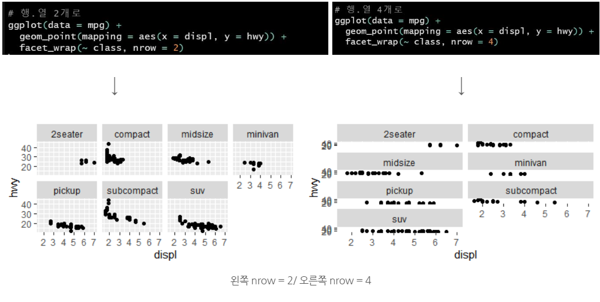
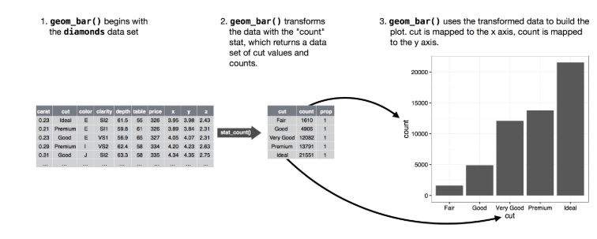
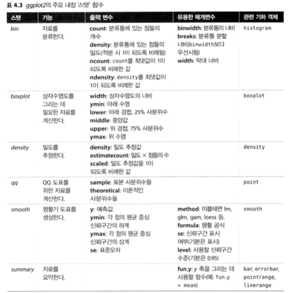

```{r setup, include=FALSE}
knitr::opts_chunk$set(echo = TRUE)
```

## 1.1 들어가기

 이 장에서는 ggplot를 이용하여 데이터를 시각화하는 법을 배울 것이다.
 
- 1.1.1 준비하기

```r
install.packages("tidyverse")
```

library(tidyverse)

## 1.2 첫 단계 

_Q. 엔진이 큰 차가 작은 차보다 연료를 더 많이 소비하는가?_

- 1.2.1 mpg 데이터프레임

```{r}
ggplot2::mpg
```

- displ : 엔진 크기 (단위 : 리터)
- hwy : 고속도로에서의 자동차 연비(단위 : 갤런당 마일, mpg), 같은 거리를 주행할 때, 연비가 낮은 차는 연비가 높은 차보다 연료를 더 많이 소비한다.

---

**1.2.2 ggplot 생성하기** 

install.packages(c("ggplot2", "plyr"))

library(ggplot2)

```{r}
library(ggplot2)         
ggplot(data = mpg) +
  geom_point(mapping = aes(x = displ, y = hwy))

```

- 이 플롯은 엔진 크기(displ)와 연비(hwy) 사이에 **음의 관계**가 있음을 보여준다. 

- **ggplot()**을 하면 좌표 시스템이 생성되고 레이어를 추가할 수 있다. 
- **ggplot(data = mpg)**를 하면 빈 그래프가 생성 
- ggplot2의 **mapping** 인수는 변수들이 시각적 속성으로 어떻게 매핑될지 정의
- mapping 인수는 **ase()**와 쌍을 이루는데 ase()의 x, y인수는 x, y축으로 매핑될 변수를 지정한다. 

***용어설명***

- 기하객체: geometric object - 줄여서 geom

- 미적속성: aesthetics property - aes() 

**그래프 작성 템플릿**

- **ggplot(data = <데이터>) +  <지옴함수>(mapping = aes(<매핑모음>)**

---

***1.2.4 연습문제*** 

1. ggplot(data = mpg)를 실행하라. 무엇이 나타나는가?

2. mpg는 행이 몇개인가? 열은 몇 개인가? 

- **?mpg** or **ggplot2::mpg**

3. drv 변수는 무엇을 나타내는가? ?mpg로 도움말 페이지를 참고하여 알아보자.

- ?mpg

- **drv** : the type of drive train, where f = front-wheel drive, r = rear wheel drive, 4 = 4wd

4. hwy 대 cyl의 산점도를 만들어라 

         ggplot(data = mpg)+ 
           geom_point(mapping = aes(x = hwy, y = cyl))

5. class 대 dvr 산점도를 만들면 어떻게 되는가? 이 플롯이 유용하지 않은 이유는 무엇인가? 

         ggplot(data = mpg)+ 
           geom_point(mapping = aes(x = class, y = dvr))
        
---

## 1.3 심미성 매핑
```{r}
ggplot(data = mpg) + 
  geom_point(mapping = aes(x = displ, y = hwy))
```

- 선형 추세를 벗어나는 점들은 무엇일까??  --> 가설 : 하이브리드 차량이 아닐까?

- 변수를 추가해서 확인해보자!

- class 별로 색깔 구분을 해보자! 

```{r}
ggplot(data = mpg) + 
  geom_point(mapping = aes(x = displ, y = hwy, color = class))
```
           
- 이를 통해 이상값 중 다수가 2인승 차임을 보여준다. 

- 이 차들은 하이브리드 차가 아닌 스포츠카로 판단된다. 

- 점의 크기로 구분을 해보면 어떨까?

```{r}
ggplot(data = mpg) + 
  geom_point(mapping = aes(x = displ, y = hwy, size = class))
```
           
- 점의 투명도로 구분을 해보면? 

```{r}         
ggplot(data = mpg) + 
  geom_point(mapping = aes(x = displ, y = hwy, alpha = class))
```

- 점의 모양별로 구분을 해보면?            
         
```{r}
ggplot(data = mpg) +
  geom_point(mapping = aes(x = displ, y = hwy, shape = class))
```

- ggplot2는 한번에 여섯 개의 모양만 사용 

- ggplot2는 기본 셋팅값으로 나머지를 처리한다.

- 지옴 심미성의 속성을 수동으로 설정할 수 도 있다. 
         
```{r}
ggplot(data = mpg) + 
  geom_point(mapping = aes(x = displ, y = hwy), color = "blue")
```

---     

***1.3.1 연습문제 ***

1. 다음의 코드는 무엇이 문제인가? 점들이 왜 파란색이 아닌가? 심미성 속성을 나누지 않아서

```{r}
ggplot(data = mpg) +
  geom_point(
    mapping = aes(x = displ, y = hwy, color = "blue")
  )
```

2. mpg의 어느 변수가 범주형인가? 어떤 변수가 연속형인가? (힌트: ?mpg를 타이핑하여 - 해당 데이터셋에 대한 설명서를 읽어보라)mpg를 실행할 때 이 정보를 어떻게 볼 수 있는가? 연비에 대한 범주

3. 연속형 변수 하나를 color, size, shape로 매핑하라. 이러한 심미성은 범주형, 연속형 변수에 따라 어떻게 다르게 작동하는가? 

```{r}
ggplot(data = mpg) +
  geom_point(
    mapping = aes(x = displ, y = hwy, shape = class, color = cty, size = trans)
  )
```

4. 하나의 변수를 여러 심미성에 매핑하면 어떻게 되는가? 

```{r}
ggplot(data = mpg)+
  geom_point(mapping = aes(x = displ, y = hwy), color = 'blue', size = 3)
```

5. stroke 심미성의 역할은 무엇인가? 어떤 모양과 함께 작동하는가?(힌트 : ?geom_point를 사용하라.) 역활은 크기, 변수와 함께 사용

```{r}
ggplot(data = mpg) +
  geom_point(mapping = aes(x = displ, hwy, stroke = 2))
```

6. aes(color = displ < 5 )처럼 심미성을 변수 이름이 아닌 다른 것에 매핑하면 어떻게 되는가?  매핑된 그래프에 표시됨

```{r}
ggplot(data = mpg) +
  geom_point(mapping = aes(x = displ, y = hwy, color = displ < 6))
```
         
## 1.4 자주 일어나는 문제들    

      ggplot(data = mpg)
       + geom_point(mapping = aes(x = displ, y = hwy))

- +는 항상 첫 줄에 와야한다.     
- ?를 활용해 도움말을 확인하자
- 오류메세지를 구글에 검색해보자.

---

## 1.5 facet

- 범주형 변수에서는 플롯을 **면분할(facet, 데이터 각 서브셋을 표시하는 하위 플롯)**로 나누는 것이 유용하다. 
- 플롯을 하나의 변수에 대해 면분할하기 위해서는 **facet_wrap()**을 이용하면 된다. 
- facet_wrap()은 **이산형**이어야 한다. 
- *이산형 변수* : 값이 문자형이나 정수형처럼 서로 떨어져 있는 유형을 의미하며, 연속형과 대비되는 용어이다.
           
```{r}
ggplot(data = mpg) + 
  geom_point(mapping = aes(x = displ, y = hwy)) +
  facet_wrap(~ class, nrow =2)
```
         
- 위의 코드에서 마지막 줄의 facet_wrap( ~ class, **nrow = 2**), 여기서 **nrow**는 : Number of rows and columns. 즉, 내가 이 그래프의 행의 개수를 정할 수 있다는 뜻입니다.



- 플롯을 두 변수 조합으로 면분할하기 위해서는 **facet_grid()**을 사용하면 유용하다.            

```{r}
ggplot(data = mpg) + 
  geom_point(mapping = aes(x = displ, y = hwy)) +
  facet_grid(drv ~ cyl) 
```
         
- 열이나 행으로 면분할하고 싶지 않다면 변수 이름 대신 **.** 을 이용해라         
  
```{r}
ggplot(data = mpg) + 
  geom_point(mapping = aes(x = displ, y = hwy)) +       facet_grid(. ~ cyl)
```
       
- ?facet_wrap "면분할"
- ?facet_grid 플롯을 '두 가지' 변수 조합으로 면분할

***1.5.1 연습문제 ***
 
1. 연속형 변수로 면분할하면 어떻게 되는가? 분활된다.

```{r}
ggplot(data = mpg) +
  geom_point(mapping = aes(x = displ, y = hwy)) +
  facet_wrap(~ drv, nrow = 1)
```

2. facet_grid(dvr ~cyl)로 만든 플롯에 있는 빈셀들은 무엇을 의미하는가? 다음의 플롯과      어떻게 연관되는가? 

```{r}
ggplot(data = mpg) + 
  geom_point(mapping = aes(x = drv, y = cyl))
```
  
3. 다음의 코드는 어떤 플롯을 만드는가? .은 어떤 역할을 하는가? 변수를 비우는 데사용

```{r}
ggplot(data = mpg) + 
  geom_point(mapping = aes(x = displ, y = hwy)) + 
  facet_grid(drv ~ .)
```
```{r}
ggplot(data = mpg) + 
  geom_point(mapping = aes(x = displ, y = hwy)) + 
  facet_grid(. ~ cyl)
```
    
4. 이 절의 면불할된 첫 번째 플롯을 살펴보라.
          
```{r}
ggplot(data = mpg) + 
  geom_point(mapping = aes(x = displ, y = hwy), color = 'green') + 
  facet_wrap(~ class, nrow = 2) # nrow는 시트를 몇 줄로 나열하는 설정하는 코드
```
  
- 색상 심미성을 쓰지 않고 면분할하면 어떤 이점이 있는가? 단점은 무엇인가? 데이터가 더 크다면 이 균형은 어떻게 바뀌겠는가?  

5. ?facet_wrap을 읽어라. nrow의 역할은 무엇인가? ncol은 어떤 일을 하는가? 개별 패널의 배치를 조정할 수 있는 다른 바아법은 무엇인가? facet_grid()에는 nrow, ncol 인수가 왜 없는가?  

- nrow는 행의 변수를 분활할 때사용, mcol은 열의 변수를 분활할 때 사용, dim은 차원반환, length는 길이 반환

- facet_grid()는 복수의 변수를 표현하는 것이기 떄분에 분활을 해버리면 그래프의 원의미를 잊어버리기 때문에

6. facet_grid()를 사용할 때, 대개의 경우 고유 수준이 더 많은 변수를 열로 두어야 한다. 왜인가? 

## 1.6 기하 객체 


- 두 플롯은 뭐가 다른가? 
```{r}
ggplot(data = mpg) + 
  geom_point(mapping = aes(x = displ, y = hwy))  
```
```{r}       
ggplot(data = mpg) + 
  geom_smooth(mapping = aes(x = displ, y = hwy))
```
  
- 지옴은 데이터를 나타내기 위해 플롯이 사용하는 기하 객체(geometrix object)를 의미한다.  
- ggplot2의 모든 지옴 함수는 mapping 인수를 가진다.
- 점의 sharpe(모양)을 설정할 수 있지만, 선의 'shape'은 설정할 수 없다. 
- 선의 linetype(선유형)을 설정할 수 있다. 
        
```{r}
ggplot(data = mpg) + 
  geom_smooth(mapping = aes(x = displ, y = hwy,         linetype = drv))
```
  
- 4는 사륜구동, f는 전륜구동, r은 후륜구동을 나타낸다.
- 여기에 색깔까지 입혀주면 보기 더 좋다. 

```{r}
ggplot(data = mpg, mapping = aes(x = displ, y = hwy)) + 
  geom_point(mapping = aes(color = drv)) +
  geom_smooth(mapping = aes(linetype = drv))
```

- 그룹 심미성은 기본적으로 범례를 추가하거나 구별시켜주는 기능들을 추가하지 않기 때문에, 이 기능을 활용하면 편리하다. 

```{r}
ggplot(data = mpg) + 
  geom_smooth(mapping = aes(x = displ, y = hwy))
```
```{r}
ggplot(data = mpg) + 
  geom_smooth(mapping = aes(x = displ, y = hwy, group = drv))
```
```{r}
ggplot(data = mpg) + 
  geom_smooth(mapping = aes(x = displ, y = hwy, color = drv), show.legend = FALSE)
```

- 같은 플롯에 여러 지옴을 표시하려면 ggplot()에 여러 지옴 함수를 추가하라. 

```{r}
ggplot(data = mpg) + 
  geom_point(mapping = aes(x = displ, y = hwy)) + 
  geom_smooth(mapping = aes(x = displ, y = hwy))
```

- 하지만 이렇게하면 불필요하게 코드가 중복해서 들어가므로 이를 **ggplot()에 넣어 묶어주면 전역 매핑**이 되어 간편하다.
  
```{r}
ggplot(data = mpg, mapping = aes(x = displ, y = hwy)) + 
  geom_point() + 
  geom_smooth()
```

- 다른 레이어마다 다른 심미성을 표시하는 것이 가능하다. 

```{r}
ggplot(data = mpg, mapping = aes(x = displ, y = hwy)) + 
  geom_point(mapping = aes(color = class)) + 
  geom_smooth()
```

- 같은 원리로 레이어마다 다른 데이터를 지정할 수 있다. 
    
```{r}
library(ggplot2)
library(dplyr)
ggplot(data = mpg, mapping = aes(x = displ, y = hwy)) + 
     geom_point(mapping = aes(color = class)) + 
     geom_smooth(data = filter(mpg, class == "subcompact"), se = FALSE)
```
        
- filter를 넣음으로서 "subcompact"(경차)만 선택 

***1.6.1 연습문제***

1. 선 그래프를 그리기 위해 어떤 지옴을 사용하겠는가? 박스 플롯을 그리려면? 히스토그램은? 면적(area)차트는?

geom_smooth

2. 머릿속으로 다음의 코드를 실행하고 출력이 어떨지 예측해보라. 그럼 다음 R에서 코드를 실행하고 여러분의 예측을 확인하라. 

```{r}
ggplot(data = mpg, mapping = aes(x = displ, y = hwy, color = drv)) + 
  geom_point() + 
  geom_smooth(se = FALSE)
```

3. show.legend = FALSE는 어떤 역할을 하는가? 삭제하면 어떻게 되는가? 앞에서 왜 이를 사용했겠는가? 

옆에 예시차트가 생긴다

4. geom_smooth() se 인수는 어떤 역할을 하는가? 

선그래프의 음영이 사라진다.

: Standard error(표준오차)를 의미한다. 

5. 다음의 두 그래프는 다르게 나타나겠는가? 왜 그런가 or 그렇지 않은가? 

위는 ggplot으로 묶어 놓아 뒤를 생략한 것이고 뒤는 모두 입력 한것 고로 같음

```{r}
ggplot(data = mpg, mapping = aes(x = displ, y = hwy)) + 
  geom_point() + 
  geom_smooth()
```
```{r}
ggplot() + 
  geom_point(data = mpg, mapping = aes(x = displ, y = hwy)) + 
  geom_smooth(data = mpg, mapping = aes(x = displ, y = hwy))
```
    
6. 다음의 그래프들을 생성하는 데 필요한 R코드를 다시 작성하라. 

```{r}
ggplot(data = mpg, mapping = aes(x = displ, y = hwy)) +
      geom_point(mapping = aes(stroke = 3)) +
      geom_smooth(se = FALSE)
    
ggplot(data = mpg, mapping = aes(x = displ, y = hwy)) +
      geom_point(mapping = aes(stroke = 3)) +
      geom_smooth(mapping = aes(group = drv), se = FALSE)

ggplot(data = mpg, mapping = aes(x = displ, y = hwy)) +
      geom_point(mapping = aes(color = drv)) +
      geom_smooth(mapping = aes(color = drv), se = FALSE) 
    
ggplot(data = mpg, mapping = aes(x = displ, y = hwy)) +
      geom_point(mapping = aes(color = drv)) +
      geom_smooth(se = FALSE) 
    
ggplot(data = mpg, mapping = aes(x = displ, y = hwy)) +
      geom_point(mapping = aes(color = drv)) +
      geom_smooth(mapping = aes(linetype = drv), se = FALSE) 
    
ggplot(data = mpg, mapping = aes(x = displ, y = hwy)) +
      geom_point(mapping = aes(color = drv), se = FALSE)
```

## 1.7 통계적 변환 

- 이번에 살펴볼 그래프는 막대그래프이다. 
- 가격(price), 캐럿(carat), 색상(color), 투명도(clarity), 컷(cut)등의 정보가 있다.
    
```{r}
ggplot(data = diamonds) + 
  geom_bar(mapping = aes(x = cut))
```
    
- x축은 cut!, 그렇다면 y축은?? 


       ?geom_bar
    
```{r}
ggplot(data = diamonds) +
  stat_count(mapping = aes(x = cut))
```

- 그래프에 사용할 새로운 값을 계산하는 알고리즘은 통계적 변환의 줄임말인 **스탯(stat)**이라고 부른다. 


- 명시적으로 스탯을 사용해야 하는 **세가지 이유**
    
1. 기본 스탯을 덮어쓰고 싶을 수 있다. 

    demo <- tribble(
           ~cut,         ~freq,
           "Fair",       1610,
            "Good",       4906,
            "Very Good",  12082,
            "Premium",    13791,
            "Ideal",      21551
                )
    
ggplot(data = demo) + 
geom_bar(mapping = aes(x = cut, y = freq), stat = "identity")

2. 변환된 변수에서 심미성으로 기본 매핑을 덮어쓰고자 할 수 있다. 예를 들어 빈도가 아니라 비율의 막대 그래프를 표시하고자 할 수 있다. 
    
```{r}
ggplot(data = diamonds) + 
            geom_bar(mapping = aes(x = cut, y = stat(prop), group = 1))
```
    
3. 코드에서 통계적 변환에 주의를 많이 집중시키고자 할 수 있다. 
    
```{r}
ggplot(data = diamonds) + 
  stat_summary(
  mapping = aes(x = cut, y = depth),
  fun.ymin = min,
  fun.ymax = max,
  fun.y = median)
```

---

***1.7.1 연습문제***

1. stat_summary()와 연관된 기본 지옴은 무엇인가? 스탯 함수 대신 이 지옴함수를 사용하여 어떻게 이전 플롯을 다시 생성하겠는가? 

2. geom_col()의 역할은 무엇인가? geom_bar()와 어떻게 다른가?

3. 대부분의 지옴과 스탯은 쌍을 이루어 거의 항상 함께 사용된다. 도움말을 읽고 모든 쌍의 목록을 만들어라. 공통점은 무엇인가? 

4. stat_smooth()는 어떤 변수를 계산하는가? 이 동작을 제어하는 파라미터들은 무엇인가? 

5. 우리의 비율 막대 그래프에서 group = 1 이라고 설정했어야 했다. 왜 그런가? 
   바꿔 말하면 다음 두 그래프의 문제는 무엇인가? 
   
   1로 설정해야 100분율 해서 나뉘기 때문에
      
```{r}
ggplot(data = diamonds) + 
           geom_bar(mapping = aes(x = cut, y = ..prop..))
```

## 1.8 위치 조정 
    
- 막대그래프에 색상을 입힐 수 있는데 color 또는 fill을 이용하면 된다. 

```{r}
ggplot(data = diamonds) + 
  geom_bar(mapping = aes(x = cut, color = cut))
    
ggplot(data = diamonds) + 
  geom_bar(mapping = aes(x = cut, fill = cut))
```

- fill 심미성을 clarity에 매핑하면 각각의 색상이 입혀진 직사각형은 cut과 clarity의 조합을 나타낸다.  

```{r}
ggplot(data = diamonds) + 
  geom_bar(mapping = aes(x = cut, fill = clarity))
```

- position = "identity"를 하면 각 객체를 그래프 문맥에 해당되는 곳에 정확히 배치한다. 막대와 겹치기 떄문에 막대에 대해서는 그다지 유용하지 않다. 겹치는 것을 구별하려면 alpha를 작은 값으로 설정하여 막대들을 약간 투명하게하거나, fill = NA 로 설정하여 완전히 투명하게 해야한다. 

```{r}
ggplot(data = diamonds, mapping = aes(x = cut, fill = clarity)) + 
 geom_bar(alpha = 1/5, position = "identity")
    
ggplot(data = diamonds, mapping = aes(x = cut, colour = clarity)) + 
geom_bar(fill = NA, position = "identity")
```

- position = "fill" 은 누적 막대들이 동일한 높이가 되어 그룹들 사이의 비율을 비교하기 쉬워진다. 
    
```{r}
ggplot(data = diamonds) +
 geom_bar(
 mapping = aes(x = cut, fill = clarity), position = "fill")
```
    
- position = "dodge"를 하면 겹치는 객체가 서로 옆에 배치된다. 이렇게 하면 개별 값들을 비교하기 쉬워진다. 

```{r}
ggplot(data = diamonds) + 
  geom_bar(mapping = aes(x = cut, fill = clarity), position = "dodge")
```
    
- 산점도 형식에서 실제 데이터 값은 234개의 관측값이 있는데 126개만 표시되어 있다. 이 문제를 "오버플롯팅"이라고 한다. 

```{r}
ggplot(data = mpg) + 
  geom_point(mapping = aes(x = displ, y = hwy))

```

- 이 떄 position = "jitter"를 하면 랜덤 노이즈가 추가되어 어 느 두 점도 같은 양의 랜덤 노이즈를 받을 가능성이 없기 때문에 포인트가 퍼지게 된다. 

```{r}
ggplot(data = mpg) + 
  geom_point(mapping = aes(x = displ, y = hwy), position = "jitter")
```
    
***1.8.1 연습문제***

1. 다음 플롯의 문제는 무엇인가? 어떻게 고치겠는가? 
    
```{r}
ggplot(data = mpg, mapping = aes(x = cty, y = hwy)) + 
  geom_point()
```
  
2. geom_jitter()에서 지터의 정도를 제어하는 파라미터들은 무엇인가? 

3. geom_jitter()에서 geom_count()를 비교 대조하라. 

4. geom_boxplot()의 위치 조정 기본값은 무엇인가? mpg 데이터셋 시각화를 생성하여 이를 표시하라. 
    
## 1.9 좌표계 

- coord_flip()은 x와 y축을 바꾼다. 
- (예를 들어) 수평 박스 플롯이 필요할 때 유용
- 라벨이 길어서 x축과 겹치지 않고 들어맞게 하기 힘들 경우에도 유용

```{r}
ggplot(data = mpg, mapping = aes(x = class, y = hwy)) + 
  geom_boxplot()

ggplot(data = mpg, mapping = aes(x = class, y = hwy)) + 
  geom_boxplot() +
  coord_flip()
```

- coord_polar()는 극좌표를 사용한다. 극좌표를 사용하면 막대 그래프와  Coxcomb차트 사이의 흥미로운 관계를 볼 수 있다. 

```{r}
 bar <- ggplot(data = diamonds) + 
  geom_bar(
  mapping = aes(x = cut, fill = cut), 
  show.legend = FALSE,
  width = 1) + 
  theme(aspect.ratio = 1) +
  labs(x = NULL, y = NULL)
  bar + coord_flip()
  bar + coord_polar()
```
       
***1.9.1 연습문제 ***
    
1. coord_polar()를 사용하여 누적 막대 그래프를 파이 차트로 바꾸라.

2. labs()는 어떤 동작을 하는가? 설명서를 읽어보자

3. coord_quickmap()과 coord_map()의 차이점은 무엇인가?

4. 다음 플롯은 도심 연비와 고속도로 연비 사이의 관계에 대해 무엇을 알려주는가? coord_fixed()왜 중요한가? geom_abline()은 어떤 동작을 하는가? 

## 1.10 그래프 레이어 문법 

         ggplot(data = <데이터>) + 
            <지옴 함수>(
              mapping = aes(<매핑모음>),
             stat = <스탯>, 
             position = <위치>
             ) +
            <좌표계 함수> +
            <면분할 함수>
       