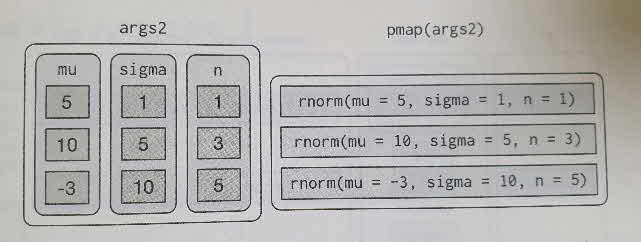
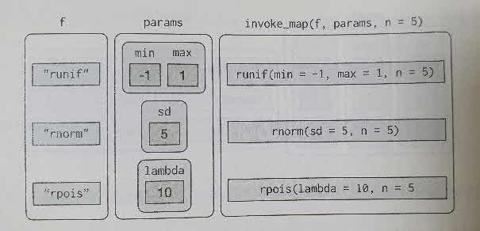

```{r setup, include=FALSE}
knitr::opts_chunk$set(echo = TRUE)
```

# 17.1 들어가기

코드 중복을 줄이면 크게 세가지 이점이 있다.

- 같은 부분이 아니라, 서로 다른 부분이 잘 보이기 때문에 코드의 의도를 확인하기 쉽다.

- 요구사항의 변화에 쉽게 대응할 수 있다. 

- 가각 코드 라인이 더 많은 곳에서 사용되었기 때문에 버그가 발생할 확률이 줄어든다.

중복을 줄이는 방법으로 두가지 방법이 있는데, 첫번째로 함수가 있는데 함수는 반복되는 코드 패턴을 식별하고 쉽게 재사용하고 업데이트 할 수 있는 독립적인 조각으로 코드를 추출하는 방법과 두번째로 반복을 하는 방법이 있는데 반복은 여러 입력에 대해 동일한 작업을 수행해야 하는 경우 이다. 이를 사용하기 위한 프로그램으로 명령형과 함수형이 존재하는데, 명령형의 경우 for루프와 while루프와 같은 도구가 있다. 이 도구들을 사용하면 반복이 매우 명시적이여서 무슨 일이 일어났는지 명확하게 알수 있다. 함수형의 경우 함수형 프로그래밍이 중복된 코드를 추출하는 도구를 제공하여 루프 패턴마다 공통된 함수를 갖는다.

` ` # for루프는 매우 장황하며 모든 for 루프마다 중복되는 부수적인 코드가 필요

` ` # 함수형 프로그래밍의 어휘를 습득하면 코드를 더 적게 사용하고, 오류를 덜 발샐시키면서 일반적인 문제를 해결

## 17.1.1 준비하기

```

library(tidyverse)

```

# 17.2 For루프

- 다음과 같은 티블이 있다고 하자.

```

df <- tibble(
  a = rnorm(10),
  b = rnorm(10),
  c = rnorm(10),
  d = rnorm(10)
)

```

- 각 열의 중앙값을 계산하고자 한다.

```

median(df$a)
#> [1] 0.3772
median(df$b)
#> [1] 0.7260
median(df$c)
#> [1] 0.5844
median(df$d)
#> [1] -0.1190

```

간단하게 붙여넣기를 할 수 있지만 붙여 넣어서 실수를 할 수 있기때문에 붙여 넣는 것 대신 for루프를 사용하면 된다.

```

output <- vector("double", ncol(df))
for (i in seq_along(df)) {
  output[[i]] <- median(df[[i]])
}

output
#> [1] 0.3772 0.726 0.5844 -0.1190

```

 **for루프**는 세가지 구성요소가 존재

- 출력, 시퀀스, 본문

**출력** 
` ` 루프 시작전 충분한 공간을 할당해야 효율성이 높아진다.

**시퀸스**
` ` 시퀸스는 무엇을 따라가며 반복해야 하는지를 결정한다.

**본문** 
` ` 실행되는 코드를 말한다.

# 17.3 For루프 변형

기초적인 for루프를 습득했다면 이제 알아야 할 몇 가지 변형이 있다. 이변형들은 반복 수행 방법에 관계없이 중요하므로 다음 절에서 배우게 될 함수형 프로그래밍 기법을 익힐 때까지 잊어버리면 안 된다.

` `**for루프의 기초적 테마**

- 새 객체를 생성하는 대신 기존 객체를 수정하기.
- 지수 대신 이름이나 값을 따라 루프하기.
- 길이가 알려지지 않은 출력 다루기
- 길이가 알려지지 않은 시퀀스 다루기

## 17.3.1 기존 객체 수정

때로는 기존 객체를 수정하기 위해 for루프를 사용하려 할 수 있다.

```

df <- tibble(
  a = rnorm(10),
  b = rnorm(10),
  c = rnorm(10),
  d = rnorm(10)
)

rescale01 <- function(x) {
  rng <- range(x, ma.rm = TRUE)
  (x - rng[1]) / (rng[2] - rng[1])
}

df$a <- rescale01(df$a)

df$b <- rescale01(df$b)

df$c <- rescale01(df$c)

df$d <- rescale01(df$d)

```
for루프로 해결하기 위해 이번에도 세 가지 구성요소에 대해 생각해보자

**출력**

` ` 출력은 입력과 같으므로 출력은 이미 정해졌다.

**시퀀스**

` ` 데이터프레임을 열의 리스트로 생각할 수 있으므로, seq_along(df)로 각 열을 따라 반복하면 된다.

**본문**

` ` rescale01()을 수행하라.

따라서 다음과 같이 된다.

```

for (i in seq_along(df)) {
  df[[i]] <- recale01(df[[i]])
}

```

- 루프로 리스트나 데이터프레임을 수정하는 작업에서 [가 아닌 [[를 사용해야 한다는 것을 주의해야 한다.

## 17.3.2 루프 패턴

백터를 따라 반복하는 세 가지 기본 방법이 있다. 

- 첫째, 가장 일반적인 for(i in seq_along(xs))를 사용하여 숫자 지수를 따라 반복하고 x[[i]]로 값을 추출하는 방법이다.
- 둘째, 요소를 따라 반복, for(x in xs). 플롯을 생성하거나 파일을 저장 하는 것과 같은 부수효과만 관심이 있는 경우에 유용한 방법이다.
- 셋째, 이름을 따라 반복, for(nm in names(xs)). 이름을 사용하여 x[[nm]]로 값에 접근하고 플롯 제목이나 파일 이름에 사용하기 유용한 방법이다.

```
results <- vector("list", length(x))

names(results) <- names(x)

```

숫자 지수를 따라 반복하는 것은 위치가 주어지면 이름과 값 모두 추출할 수 있기 때문에 가장 일반적인 형태이다.

```

for (i in seq_along(x) {
  name <- names(x)[[i]]
  value <- x[[i]]
}

```

## 17.3.3 길이를 모르는 출력

종종 출력의 길이가 얼마나 되는지 모르는 경우가 있다. 예를 들어 임의 길이의 임의 백터를 시뮬레이션해야 하는 문제가 있다. 이럴 경우 점진적으로 늘려가는 방법으로 문제를 해결하려 할 것이다.

```
means <- c(0, 1, 2)

output <- double()
for (i in seq_along(mean)) {
  n <- sample(100, 1)
  output <- c(output, rnorm(n, means[[i]]))
}

str(output)
#> num [1:92] -0.102 0.397 0553 -0.279 -1.609

```

이 방법은 효율적이 않은데, R은 각 차수마다 이전 차수의 데이터를 모두 복사해야 하기 떄문이다. 좀 더 나은 해결책은 결과를 리스트에 저장한 다음, 루프가 완료된 후 단일 벡터로 결합하는 것이다.

```

out <- vector("list", length(means))
for (i in seq_along(means)) {
  n <- sample(100, 1) 
  out[[i]] <- rnorm(n, means[[i]])
}

str(out)
#> List of 3
#> $ : [1:68] 0.4628 -0.3468 0.0038 -0.3681 -0.9252 ...
#> $ : [1:15] 1.75 -0.593 1.852 0.918 1.073 ...
#> $ : [1:9] 1.5 2.99 1.84 3.71 3.07 ...

str(unlist(out))
#> num [1:92] 0.4628 -0.3468 0.0038 -0.3681 -0.9252 ...
```
unlist()를 사용하여 백터의 리스트를 단일 백터로 플랫하게 만들었다. 더 정밀한 방법은 purrr::flatten_dbl()을 사용하는 것이다. 입력이 더블형의 리스트가 아닌 경우 오류를 발생시킨다.
` ` 이런 패턴은 다른 곳에서도 나타난다
- 긴 문자열을 생성하는 경우이다. 각 반복을 이전과 함께 paste()하는 대신 출력을 문자형 백터에 저장한 다음 paste(output, colleapse = "")를 사용하여 단일 문자열로 결합한다.
-큰 데이터프레임을 생성하는 경우이다. 각 차수에 순차적으로 rbind()하는 대신 출력을 리스트에 저장한 후 dplyr::bind_rows(output)을 사용하여 데이터프레임 하나로 결합한다.

## 17.3.4 길이를 모르는 시퀸스

때로는 입력 시퀸스의 길이를 알지 못하는 경우도 있다. 보통 시뮬레이션 할 때 자주 발생한다. 예를 들어 앞면을 세ㅔ 번 연속으로 얻기까지 반복하는 문제가 있다. 이때 for 루프로는 이러한 반복을 할 수 없다. 이때 while 루프를 사용하면 된다. while 루프는 조건과 본문, 두 가지 구성요소만 있기 때문에 for 루프보다 간단하다.

```

while (condition) {
  # 본문
}

```
while 루프는 for 루프보다 더 범용적이다. 어떤 for 루프도 while 루프로 다시 자성할 수 있지만, 모든 while 루프를 for 루프로 작성할 수 있는 것은 아니기 때문이다.

```

for (i in seq_along(x)) {
  # 본문
}

```

 # 위는 다음과 같음

```

i <- 1
while (i <- length(x)) {
  # 본문
  i <- i + 1
}

```

연속으로 앞면을 세 번 얻을 때까지 걸린 시도 횟수를 while 루프를 사용하여 구하는 방법은 다음과 같다.

```

flip <- function() sample(c("T", "H"), 1)

flips <- 0
nheads <- 0

while (nheads < 3) {
  if (flip() == "H") {
    nheads <- nheads + 1
  } else {
    nheads <- 0
  }
  flips <- flips + 1
}

flips
#> [1] 34

```

while 루프를 간략하게만 이야기했는데, 개인적으로 거의 사용하지 않기 때문이다. 시뮬레이션할 때 가장 자주 사용되는데, 이는 이 책의 범위를 벗어난다. 하지만 이런 것이 있다는 것을 알아두면 반복 수를 미리 알지 못하는 문제에 대비 할 수 있어서 좋다.

## 17.3.5 연습문제

1.읽으려고 하는 CSV파일들로 가득 찬 디렉터리가 있다고 하자. 벡터 files <- dir("data/", pattern = "\\.csv$, full.name = TRUE)에 경로가 있으므로, 각 경로를 read_csv()로 읽으려고 한다. 이들을 단일 데이터프레임으로 불러오는 for루프를 작성하라.

2.for (nm in name(x))를 사용할 때 x가 이름이 없으면 어떻게 되는가? 일부 요소만 이름이 있으면 어떻게 되는가? 이름이 고유하지 않으면 어떻게 되는가?

3.데이터프레임의 각 수치형 열의 평균을 이름과 함께 인쇄하는 함수를 작성하라. 예를 들어 show_mean(iris)는 다름과 같이 인쇄해야 한다.

```

show_mean(iris)

```

4.다음의 코드는 어떤 일을 하는가? 어떤 방법으로 하는가?

```
trans <- list(
  disp = function(x) x * 0.0163871,
  am = function(x) {
    factor(x, labels = c("auto", "manual"))
  }
)
for (var in names(trans)) {
  mtcars[[var]] <-trans[[var]](mtcars[[var]])
}
```

# 17.4 For 루프 vs 함수형

R이 함수형 프로그래밍 언어이기 때문에, R에서 for 루프는 다른 언어에서만큼 중요하지는 않다. 즉, for 루프를 직접 사용하는 대신, 이를 함수에 포함시키고 이 함수를 호출할 수 있다.
 이것이 중요한 이유를 보기 위해 다음의 간단한 데이터프레임을 보자.
 
```

df <- tibble(
  a = rnorm(10),
  b = rnorm(10),
  c = rnorm(10),
  d = rnorm(10)
)

```
 
각 열을 평균연산한다고 가정하자. for루프로 할 수 있다.

```

output <- vector("double", length(df))
for (i in seq_along(df)) {
  output[[i]] <- mean(df[[i]])
}

output
#> [1] 0.1475 -0.0875 0.1888 0.5484

```

col_mean() 함수를 복사하여 붙여넣고, mean()을 median() 및 sd()로 바꾼다.

```

col_median <- function(df) {
  output <- vector("double", length(df))
  for (i in seq_along(df)) {
  output[i] <- median(df[[i]])
  }
  output
}

col_sd <- function(df) {
  output <- vector("double", length(df))
  for (i in seq_along(df)) {
  output[i] <- sd(df[[i]])
  }
  output
}  

```

이코드의 대부분은 for루프 상용구이며 함수들 사이에 다른 부분(mean(), median(), sd())을 알아보기 쉽지 않다.
 다음과 같은 함수군이 있다면 어떻게 할것인가?
 
```

f1 <- function(x) abs(x - mean(x)) ^ 1

f2 <- function(x) abs(x - mean(x)) ^ 2

f3 <- function(x) abs(x - mean(x)) ^ 3

```

중복이 많다는 것을 알아채고 이를 추가 인수로 추출할 것이다.

```

f <- function(x, i) abs(x - mean(x)) ^ i

```

버그가 발생할 가능성을 줄였고(고드가1/3로 짧아짐) 새로운 상황에 맞추어 일반화하기 쉬워졌다.
 각 열에 적용시킬 함수를 인수로 제공하자.

```

col_summary <- function(df, fun) {
  out <- vector("double", length(df))
  for (i in seq_along(df)) {
  out[i] <- fun(df[[i]])
}

col_summary(df, median)
#>

col_summary(df, mean)
#>

```

함수를 다른 함수로 전달하는 것은 매우 강력한 개념이며, R이 함수형 프로그래밍 언어가 되는 동작 중 하나이다. for루프 대신 purrr함수들을 사용하면 리스트 조작 문제를 독립적인 조각들로 나눌 수 있다.

- 리스트의 단일 요소에 대해서만 문제를 푼다면 어떻게 해결하겠는가? 이 문제를 해결했다면 리스트의 모든 요소들에 이 해답을 일반화하는 것은 purrr이 해결해준다.
- 복잡한 문제를 해결하는 경우, 해결책으로 한 것ㄹ음 나아가기 위해 문제를 쉬운 크기로 분해하는 방법은 무엇일까? purrr을 사용하면 파이프와 함께 작성 할 수 있는 작은 조각 여러 개로 만들수 있다.
- 이 구조를 사용하면 새로운 문제를 쉽게 해결할 수 있다. 또한 이전 코드를 다시 읽을 때 문제를 어떻게 해결했는지 더 쉽게 이해할 수 있다.

# 17.5 맵 함수

백터를 따라 루프를 돌며, 각 요소에 어떤 작업을 하고, 결과를 저장하는 패턴은 매우 일반적이다. purrr패키지에는 이런 작업을 수행하는 함수 모음이 있다.

- map() 리스트 출력
- map_lgl() 논리형 벡터 출력
- map_int() 정수형 벡터 출력
- map_dbl() 더블형 벡터 출력
- map_chr() 문자혈 벡터 출력

각 함수는 백터를 입력으로, 각 조각에 함수를 적용한 후, 입력과 길이가 같고 이름들이 같은 새로운 벡터를 반환한다. 반환 벡터이 유형은 map함수의 접미사에 의해 결정된다.
ma()과 같은 함수들을 사용하는 함수들을 사용하는 주된 이점은 속도가 아니라 명확성이다. 함수들은 코드를 쓰고 읽기 쉽게 만든다.
요약 함수들은 더블형을 반환했으므로, map_dbl()을 사용해야 한다.

```

map_dbl(df, mean)
#>       a       b     c      d
#> -0.2324 -0.4140 0.043 -0.614

map_dbl(df, median)
#>       a       b      c      d
#> -0.0593 -0.4388 0.1473 0.0052

map_dbl(df, sd)
#>       a      b      c      d
#>  1.0980 1.0083 0.7953 0.7691

```

for루프를 사용했을 때와 비교하면 모든 요소를 따라 반복하고 결과를 저장하는 단순작업이 아닌, 수행되는 연산(mean(), median(), sd())이 부각된다.

```

df %>% map_dbl(mean)
#>       a       b      c       d
#> -0.2324 -0.4140 0.0437 -0.0614

df %>% map_dbl(median)
#>       a       b      c      d
#> -0.0593 -0.4388 0.1475 0.0052

df %>% map_dbl(sd)
#>      a      b      c      d
#> 1.0980 1.0083 0.7953 0.7691

```

map_*()과 col_summery() 사이에 차이점은 아래와 같다.

- 모든 purrr함수는 c로 구현되었다. 가독성이 희생되었지만, 약간 빨라지게 된다.
- 적용할 함수를 나타내는 두 번째 인수 .f로 공식, 문자형 벡터나 정수형 벡터를 지정할 수 있다.
- map_*()은 .f가 호출이 될 때마다 추가 인수를 ...을 사용하여 전달할 수 있다.

```

map_dbl(df, mean, trim = 0.5)
#>       a       b      c      d
#> -0.0593 -0.4388 0.1475 0.0052

z <- list(x = 1:3, y = 4:5)
map_int(z, length)
#>  x  y
#>  3  2

```

## 17.5.1 단축어

타이핑을 줄이기 위해 .f와 함께 사용할 수 있는 단축어가 몇 개 있다.

```

models <- mtcars %>%
  split(.$cyl) %>%
  map(function(df) lm(mpg ~ wt, data = df))
  
```

purrr에는 편리한 단축어인 한쪽 공식이 있다.

```

models <- mtcars %>%
  split(.$cyl) %>%
  map(~lm(mpg ~ wt, data = .))

```

위에서 .을 대명사로 사용했는데, 현재 리스트 요소를 가리킨다. for루프에서 i가 현재 지수를 가리키는 것과 같다. 

많은 모형을 보면 R2와 같은 요약 통계량을 추출하고 싶은 경우가 있다. 이를 위해서 먼저 summary()를 실행한 뒤 r.squared라는 요소를 추출해야 한다.

```

models %>%
  map(summary) %>%
  map_dbl(~.$r.squared)
#>      4      6      8
#> 0.5086 0.4645 0.4229

```

명명된 구성요소를 추출하는 것은 자주하는 연산이므로 purrr에 있는 더 짧은 단축어가 있는데, 바로 문자열을 사용할 수 있다.

```
models %>%
  map(summary) %>%
  map_dbl("r.squared")
#>      4     6      8
#> 0.5086 0.4645 0.4229
```

정수형을 사용하여 위치로 요소를 선택할 수도 있다.

```
x <- list(list(1, 2, 3), list(4, 5, 6), list(7, 8, 9))
x %>%
map_dbl(2)
#> 2 5 8
```

## 17.5.2 베이스 R

베이스 R의 apply함수 계열에 익숙하면 purrr함수들과 같은 유사점이 있다.

- lapply()는 map()과 기본적으로 같다. 차이점은 map()은 purrr의 다른 모든 함수와 일관성이 있고 .f에 단축어를 사용할 수 있다는 것이다.
- 베이스 sapply()는 lapply()의 출력을 자동으로 단순하게 만드는 래퍼이다. 이 함수는 대화식 작업에는 유용하지만, 함수 안에는 어떤 출력을 얻게 될지 모르기 때문에 문제가 된다.
- vapply()는 유형을 정의하는 추가 인수를 제공하기 때문에 sapply()의 안전한 대체함수이다. vapply(df, is.numetic, logical(1))은 map_lgl(df, is.numeric)과 동일하다.

```
x1 <- list(
  c(0.27, 0.37, 0.57, 0.91, 0.20),
  c(0.90, 0.94, 0.66, 0.63, 0.06),
  c(0.21, 0.18, 0.69, 0.38, 0.77)
)

x2 <- list(
  c(0.50, 0.72, 0.99, 0.38, 0.78),
  c(0.93, 0.21, 0.65, 0.13, 0.27),
  c(0.39, 0.01, 0.38, 0.87, 0.34)
)

threshold <- function(x, cutoff = 0.8) x[x > cutoff]
x1 %>% sapply(threshold) %>% str()
#> list of 3
#> $ : num 0.91
#> $ : num [1:2] 0.9 0.94
#> $ : num(0)

x2 %>% sapply(threshold) %>% str()
#> num [1:3] 0.99 0.93 0.87
```

# 17.6 실패 다루기

맵 함수를 사용해 많은 연산을 반복할 때, 연산 중 하나가 실패할 확률이 매우 높다. 이 경우 오류 메시지가 표시되고 출력은 표시되지 않는다.
safely()를 사용하여 이러한 상황을 다루는 법을 배울 것 이다. safely()는 부사이다. 함수(동사) 를 사용하고 수정된 버전을 반환 한다. 이 경우 수정된 버전은 오류를 발생시키지 않는다. 대신 항상 다음의 두 요소로 이루어진 리스트를 반환한다.

- result
  원 결과. 오류가 있다면 이는 NULL이 될 것이다.
  
- error
  오류 객체. 연산이 성공적이었다면 이는 NULL이 될 것이다.
  
```
safe_log <- safely(log)
#>      4      6      8
#> 0.5908 0.4645 0.4229

str(safe_log(10))
#> list of 2
#> result : num 2.3
#> error : NULL

str(safe_log("a"))
#> list of 2
#> $ result : NULL
#> $ error : list of 2
#>  ..$ messge : chr "수학함수에 숫자가 아닌 인자가 전달되었습니다"
#>  ..$ call   : language .primitive("log")(x, base)
#>  ..-attr(*, "class")= chr [1:3] "simpleError" "error" "condfition"

```

함수가 성공한 경우 result요소는 결과를 포함하게 되고 error요소는 NULL이 된다. 함수가 실패한 경우, result요소는 NULL이 되고 error요소는 오류 객체를 포함하게 된다.

safely()는 다음과 같이map과 함께 수행되도록 설계되었다.
```
x <- list(1, 10, "a")
y <- x %>% map(safely(log))
str(y)
#> list of 3
#>  $ :list of 2
#>   ..$ result: num 0
#>   ..$ error : NULL
#>  $ : list of 2
#>   ..$ result: num 2.3
#>   ..$ error : NULL
#>  $ :list of 2
#>   ..$ result: NULL
#>   ..$ call  : list of 2
#>   .. ..$ message: chr "수학함수에 숫자가 아닌 인자가 전달되었습니다"
#>   .. ..$ call   : language .primitive("log")(x, base)
#>   .. ..- attr(*, "class")= chr [1:3] "simpleError" "error" condution"

```
리스트가 두 개 있으면 작업하기가 더 쉬울 것이다. purrr::transpose()를 사용하면 쉽게 얻을 수 있다.
 
```
y <- y %>% transpose()
str(y)
#> List of 2
#>  $ result:List of 3
#>   ..$ : num 0
#>   ..$ : num 2.3
#>   ..$ : NULL
#>  $ error :List of 3
#>   ..$ : NULL
#>   ..$ : NULL
#>   ..$ :List of 2
#>   .. ..$ message: chr "수학함수에 숫자가 아닌 인자가 전달되었습니다"
#>   .. ..$ call   : language .Primitive("log")(x, base)
#>   .. ..- attr(*, "class")= chr [1:3] "simpleError" "error" "condition"
  
```
 
나름대로 오류를 처리하는 법이 있겠지만, 일반적으로 y값이 오류인 x 값을 보거나, 정상인 y값을 살펴볼 것이다.
 
```
is_ok <- y$error %>% map_lgl(is_null)
x[!is_ok]
#> [[1]]
#> [1] "a"

y$result[is_ok] %>% flatten_dbl()
#> [1] 0.000000 2.302585

```

purrr에는 이밖에도 유용한 형용사 두 개가 있다.

- safely()와 같이 possibly()는 항상 성공한다. 오류 시 반환할 기본값을 지정할 수 있기 때문에 safely()보다 단순하다.

```
x <- list(1, 10, "a")
x %>% map_dbl(possibly(log, NA_real_))
#> [1] 0.000000 2.302585       NA

```

- quietly()는 safely()와 비슷한 역할을 수행하지만 오류를 캡쳐하는 대신 인쇄 되는 출력, 메시지 경고를 캡쳐한다.

```
x <- list(1, -1)
x %>% map(quietly(log)) %>% str()
```

# 17.7 다중 인수로 매핑

다중의 연관된 인풋을 따라가며 병렬로 반복해야 하는 경우가 종종 있다. map2()와 pamp이 바로 이 작업을 한다.

```
mu <- list(5, 10, -3)
mu %>%
  map(rnorm, n = 5) %>%
  str()
#> List of 3
#>  $ : num [1:5] 4.53 4.85 5.1 5.15 4.74
#>  $ : num [1:5] 8.86 10.44 11.33 11.15 10.67
#>  $ : num [1:5] -3.1 -3.54 -2.21 -3.51 -3.39

```

표준편차도 변경시키고 싶다면 지수를 따라 반복하고, 평균과 표준편차 벡터에 인덱싱하는 것이다.

```

sigma <-list(1, 5, 10)
seq_along(mu) %>%
  map(~rnorm(5, mu[[.]], sigma[[.]])) %>%
  str()
#> List of 3
#>  $ : num [1:5] 4.36 5.67 5.72 4.36 5.38
#>  $ : num [1:5] 3.12 13.5 2.28 9.84 9.73
#>  $ : num [1:5] -17.8 4.78 7.51 2.29 -1.92

```

코드의 의도가 모호하게 되었다. 대신 map2()를 사용할 수 있다.

```

map2(mu, sigma, rnorm, n = 5) %>% str()
#> List of 3
#>  $ : num [1:5] 4.62 5.18 6.76 4.29 3.91
#>  $ : num [1:5] 14.03 10.26 2.05 2.12 10.75
#>  $ : num [1:5] -20.608 0.466 -20.39 -9.45 -16.678
 
```

amp2()는 다음과 같은 일련의 함수를 호출 했다.


매 호출마다 변하는 인수는 함수 앞에 오고, 매 호출마다 동일한 인수는 뒤에 온다는 것을 주목해야 한다.
**map()**과 **map2()**는 for루프를 감싸는 래퍼일 뿐이다.

```

map <- function(x, y, f, ...) {
  out <- vector("list", length(x))
  for (i in seq_along(x)) {
    out[[i]] <- f(x[[i]], y[[i]], ...)
  }
  out
}

```

마찬가지로 map3, map4 등을 생각해볼 수도 있겠지만 너무 복잡해진다. 대신 purrr에는 인수 리스트를 취하는 pmap()이 있다. 이는 평균, 표준편차, 표본의 개수를 변경하려는 경우 사용할 수 있다.

```

n <- list(1, 3, 5)
argsl <- list(n, mu, sigma)
argsl %>%
  pmap(rnorm) %>%
  str()
#> List of 3
#>  $ : num 4.63
#>  $ : num [1:3] 1.99 6.99 12.5
#>  $ : num [1:5] 5.89 -3.88 4.69 -5.13 -12.53
 
```


리스트 요소의 이름이 없다면 pmap()이 호출될 때, 위치 매칭을 사용할 것이다. 이 경우 오류가 발생하기 쉽게 되고 코드를 읽기 더 어렵게 만들기 때문에 인수를 며명하는 것이 좋다.

```

args2 <- list(mean = mu, sd = sigma, n = n)
args2 %>%
  pmap(rnorm) %>%
  str()
#> List of 3
#>  $ : num 3.59
#>  $ : num [1:3] 5.88 8.75 3.09
#>  $ : num [1:5] 1.89 -15.39 2.61 16.91 3.17
 
```

호출문이 더 길어지지만 더 안전하게 된다.


  
인수의 길이가 모두 같기 때문에 데이터프레임으러 저장하는 것이 좋다.

```
params <- tribble(
  ~mean, ~sd, ~n,
     5,    1,   1,
    10,    5,   3,
    -3,   10,   5
)

params %>%
  pmap(rnorm)
#> [[1]]
#> [1] 3.481782

#> [[2]]
#> [1] 11.4233838 17.2379021 -0.1799164

#> [[3]]
#> [1]  -3.649203  24.168462 -10.152586  -5.751451   3.681764
  
```
코드가 복잡해지기 시작하면 바로 데이터프레임을 사용하는 것이 더 좋은 방법일 것이다.

## 17.7.1 다른 함수 불러오기

인수를 변경하는 것뿐만 아니라 함수 자체도 변경하고 싶을 수 있다.

```

f <- c("runif", "rnorm, "rpois")
param <- list(
  list(min = -1, max = 1),
  list(sd = 5),
  list(lambda = 10)
)

```

invoke_map()를 사용하여 이 경우를 다룰 수 있다.

```

invoke_map(f, param, n = 5) %>% str()

```



첫 번째 인수는 함수의 리스트 또는 함수 이름의 문자형 벡터이다. 두 번째 인수는 각 함수마다 변경되는 인수 리스트의 리스트이다. 그 다음 인수는 모든 함수에 전달된다.
tribble()을 사용하여 이렇게 일치하는 쌍을 좀 더 쉽게 만들수 있다.

```

sim <- tribble(
  ~f,      ~params,
  "runif", list(min = -1, max = 1),
  "rnorm", list(sd = 5),
  "rpois", list(lambda = 10)
)
sim %>%
  mutate(sim = invoke_map(f, params, n = 10))

```

# 17.8 워크

워크는 반환값이 아닌 부작용을 위해 함수를 호출하고자 할 경우 맵 함수의 대안으로 사용할 수 있다. 결과를 스크린에 렌더링하거나 디스크에 파일을 저장하는 것과 같이, 반환값이 아니라 동작이 중요하기 때문에 이를 사용한다.

```

x <- list(1, "a", 3)

x %>%
  walk(print)
#> [1] 1
#> [1] 10
#> [1] "a"

```

walk()는 walk2()나 pwalk()에 비해 일반적으로 그다지 유용하지 않다. 예를 들어 플롯 리스트와 파일명 벡터가 있는 경우 pwalk()를 사용하여 디스크의 해당 위치에 각 파일을 저장할 수 있다.

```
library(ggplot2)
plots <- mtcars %>%
  split(.$cyl) %>%
  map(~ggplot(., aes(mpg, wt) + geom_point))
paths <- stringr::str_c(names(plots), ".pdf")

pwalk(list(paths, plots), ggsave, path = tempdir())

```

walk(), walk2(), pwalk()는 모두 첫 번째 인수 .x를 보이지 않게 반환한다. 따라서 이 함수들을 파이프라인 중간에서 사용하기 적절하다.

# 17.9 For루프의 기타 패턴

purrr에는 for루프의 기타 유형을 추상화하는 함수들이 많이 있다. 이 함수들은 맵 함수보다 드물게 드물게 사용되지만 알고 있으면 유용하다. 

## 17.9.1 논리서술자 함수

많은 함수는 단일 TRUE나 FALSE를 반환하는 논리서술자(predicate) 함수와 함께 작동한다.
keep()과 discard()는 입력에서 논리서술이 각각 TRUE이 거나 FALSE인 요소를 반환한다.

```
iris %>%
  keep(is.factor) %>%
  str()
#> 'data.frame':	150 obs. of  1 variable:
#>  $ Species: Factor w/ 3 levels "setosa","versicolor",..: 1 1 1 1 1 1 1 1 1 1 ...
 
iris %>%
  discard(is.factor) %>%
  str()
#> 'data.frame':	150 obs. of  4 variables:
#>  $ Sepal.Length: num  5.1 4.9 4.7 4.6 5 5.4 4.6 5 4.4 4.9 ...
#>  $ Sepal.Width : num  3.5 3 3.2 3.1 3.6 3.9 3.4 3.4 2.9 3.1 ...
#>  $ Petal.Length: num  1.4 1.4 1.3 1.5 1.4 1.7 1.4 1.5 1.4 1.5 ...
#>  $ Petal.Width : num  0.2 0.2 0.2 0.2 0.2 0.4 0.3 0.2 0.2 0.1 ...
 
```

some()과 every()는 논리서술이 일부 혹은 모든 요소가 참인지를 확인한다.

```
x <- list(1:5, letters, list(10))

x %>%
  some(is_character)
#> [1] TRUE

x %>%
  every(is_vector)
#> [1] TRUE

```

detect()는 논리서술이 참인 첫 번째 요소를 찾는다. detect_index()는 해당 위치를 반환한다.

```
x <- sample(10)
x
#>  [1]  3  9  2  7  8  4 10  1  6  5

x %>%
  detect(~ . > 5)
#> [1] 9

x %>%
  detect_index(~ . > 5)
#> [1] 2

```

head_while()과 tail_while()은 벡터의 시작 혹은 끝에서부터 논리서술자가 참인 요소들을 반환한다.

```
x %>%
  head_while(~ . > 5)
#> integer(0)

x %>%
  tail_while(~ . > 5)
#> integer(0)

```

## 17.9.2 리듀스와 누적

테이블 두 개를 입력으로 하는 dplyr 동사를 여러 테이블에 적용할 때 유용하다. 예를 들어 데이터프레임 리스트가 있을때, 리스트의 요소를 조인해서 하나의 데이터프레임으로 만글려면 다음과 같이 하면 된다.

```
dfs <- list(
  age = tibble(name = "John", age = 30),
  sex = tibble(name = c("John", "Mary"), sex = c("M", "F")),
  trt = tibble(name = "Mary", treatment = "A")
)
dfs %>% reduce(full_join)
Joining, by = "name"
Joining, by = "name"
#> # A tibble: 2 x 4
#>   name    age sex   treatment
#>   <chr> <dbl> <chr> <chr>    
#> 1 John     30 M     NA       
#> 2 Mary     NA F     A     

```

또는 벡터의 리스트가 있을 때, 교집합을 구하는 방법은 다음과 같다.

```
vs <- list(
  c(1, 3, 5, 6, 10),
  c(1, 2, 3, 7, 8, 10),
  c(1, 2, 3, 4, 8, 9, 10)
)

vs %>% reduce(intersect)
#> [1]  1  3 10

```

reduce함수는 '이진' 함수(즉, 기본 입력이 두 개인 함수)를 입력으로, 이를 하나의 요소만 남아있을 때까지 반복적으로 리스트에 적용한다.
 누적은 비슷하지만 중간 결과를 모두 유지한다. 누적 합계를 구현할 때 사용할 수 있다.

```
x <- sample(10)
x
#>  [1]  4  3 10  2  5  6  9  1  8  7

x %>% accumulate('+')

```
 


