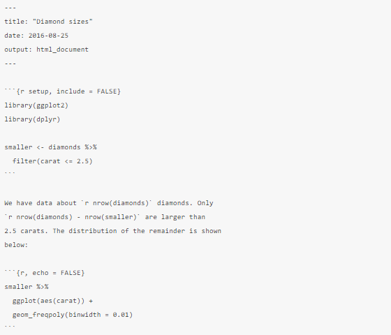
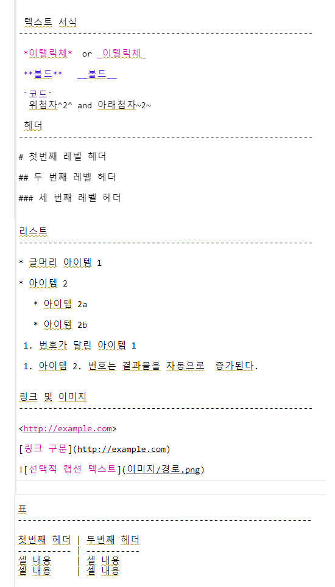
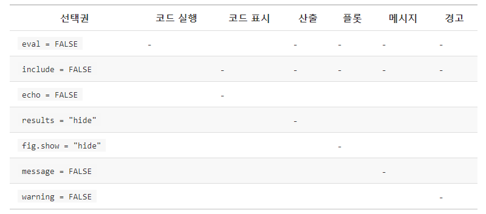
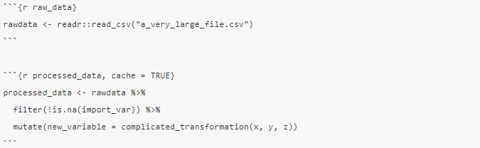
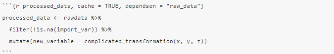
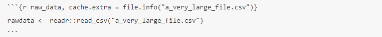
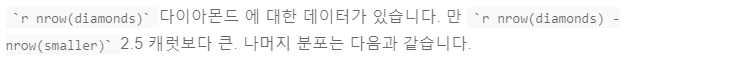
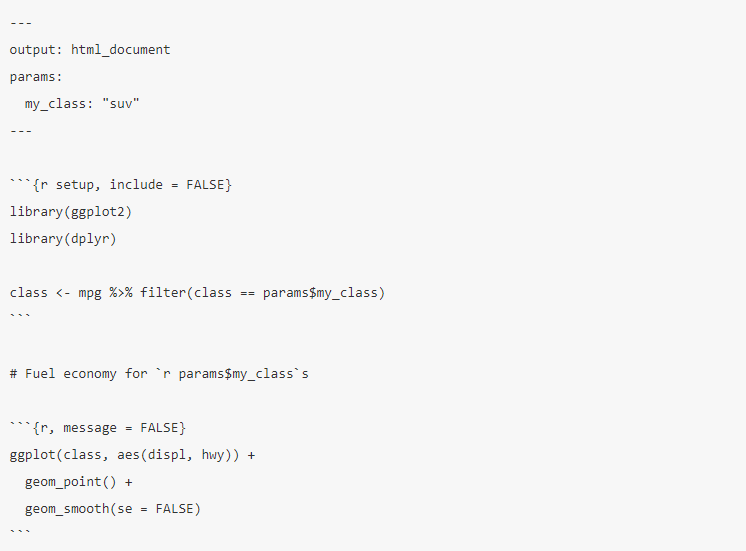

```{r setup, include=FALSE}
knitr::opts_chunk$set(echo = TRUE)
```

### R Markdown

## 21.1 들어가기 

R 마크다운은 ’데이터 과학을 위한 통합 저작 프레임워크’이며 코드, 결과물과 풀어 쓴 해설로 구성되어 있다. R 마크다운 문서는 완벽하게 재현 가능하며 PDF, 워드 파일, 슬라이드쇼 등을 포함한 수십 가지 출력 형식을 지원한다.
R마크다운 파일은 다음 세 가지 방법으로 사용하도록 설계되었다.

- 분석 코드보다는 분석 결과에 관심이 있을 의사결정권자와 의사소통을 위해

- 분석 결론과 그 과정(즉, 코드)에 관심이 있는 다른 데이터 과학자들과 협업을 위해

- 데이터 과학을 수행하는 환경으로써. 즉, 실행한 것 외에 생각한 것까지 남길 수 있는 현대식 실험실 노트와 같은 용도이다.

R마크다운에는 수많은 R 패키지와 외부 도구가 통합되어 있다. 

- R 마크다운 치트시트: Help > Cheatsheets > R Markdown Cheat Sheet,

- R 마크다운 참조 안내서: Help > Cheatsheets > R Markdown Reference Guide.

 위 두 개의 치트시트  (http://rstudio.com/cheatsheets)
 
### 21.1.1 준비하기
 
 rmarkdown 패키지가 필요하지만, 설치하거나 로드할 필요는 없다. 
 
 - RStudio가 필요에 따라 자동으로 수행할수 있다.
 
## 21.2 R 마크다운 기초

 R 마크다운 파일, 즉 확장자가 .Rmd 인 포맷이 없는 텍스트 파일이다.




위 파일에는 세 가지 중요한 내용이 포함되어 있다.

1. ---으로 둘러싼 YAML 헤더 (선택항목).

2. ``` 으로 둘러싼 R 코드 청크 (코드묶음, Chunk).

3. heading 및 _italic_과 같은 간단한 텍스트 서식과 텍스트.

확장자 .Rmd 파일을 열면 코드와 출력이 번갈아 표시되는 인터페이스가 나온다. 
Run 아이콘을 클릭하거나 Cmd/Ctrl+Shift+Enter를 눌러 각 코드 청크를 실행할 수 있다.
RStudio에서 코드가 실행되고, 실행결과가 코드와 함께  표시됩니다.


텍스트, 코드와 실행결과 모두가 포함된 최종 보서를 작성

- ’Knit’을 클릭하거나 Cmd/Ctrl-Shift-K를 입력 

- rmarkdown::render("1-example.Rmd")으로 프로그램화

뷰어 창에 보고서가 나타나고, 다른 사용자와 공유할 수 있는 HTML 파일이 만들어진다.


문서를 니트(knit) 하면 R마크다운은 .Rmd 파일을 knitr, 로 보내고 __knitr__는 모든 코드 청크를 실행하고 코드와 그 출력을 포함하는 새로운 마크다운 문서(.md)를 생성한다. 이렇게 생성된 마크다운 파일은 이후 pandoc이 처리하는데, pandoc은 완성 파일을 생성하는 역할을 한다. 이와 같이 작업이 두 단계로 나누어져서, 다양한 출력 형식을 만들 수 있다는 장점이 있다.


이 그림은 R마크다운의 주요 기능이 어떻게 작동하는지를 보여준다.


## 21.3 마크다운으로 텍스트 서식 저장하기

확장자 .Rmd 파일 내부의 문장은 마크다운 문법으로 작성되는데, 일반 텍스트 파일의 형식을 지정하기 위한 간단한 규칙이다.  R마크다운에서도 실행되는 마크다운의 소폭 확장 버전인 Pandoc 마크다운을 사용하는 방법을 보여준다.

<!--
텍스트 서식 
------------------------------------------------------------

 *이탤릭체*  or _이텔릭체_
 
 **볼드**   __볼드__
 
 `코드`
  위첨자^2^ and 아래첨자~2~

 헤더
------------------------------------------------------------

# 첫번째 레벨 헤더

## 두 번째 레벨 헤더

### 세 번째 레벨 헤더

리스트
------------------------------------------------------------

* 글머리 아이템 1

* 아이템 2
  
   * 아이템 2a
   
   * 아이템 2b
   
 1. 번호가 달린 아이템 1
 
 1. 아이템 2. 번호는 결과물을 자동으로  증가된다.


링크 및 이미지 
------------------------------------------------------------

<http://example.com>

[링크 구문](http://example.com)


표
------------------------------------------------------------

첫번째 헤더 | 두번째 헤더
----------- | -----------
셀 내용     | 셀 내용
셀 내용     | 셀 내용
-->



이것들을 익히는 가장 좋은 방법은 한 번 만들어 보는 것이다. 

잊어버린 경우 Help > Markdown Quick Reference를 사용하여 편리한 참조 시트를 찾아볼 수 있다.


## 21.4 코드 청크

R마크다운 문서에서 코드를 실행하려면 청크를 삽입해야 한다. 세 가지 방법이 있다.

   1. 키보드 단축키 Cmd/Ctrl+Alt+I

   2. 편집기 툴바의 ’Insert’ 버튼 아이콘

   3. 청크 구분 기호 ```{r} 과 ``` 를 수동으로 타이핑

- 단축키를 외울 것을 추천한다. 많은 시간을 절약해줄 것이다!

코드를 실행하기 위해, 앞에서 배워서 아마 지금쯤이면 애용하고 있을, 키보드 단축키 Cmd/Ctrl+Enter를 계속 이용해도 된다. 그러나 새로운 키보드 단축키인 Cmd/Ctrl+Shift+Enter 를 사용하여 청크의 모든 코드를 실행할 수 있다. 청크를 함수라고 생각하라. 청크는 상대적으로 자립(self-contained) 해야 하며 단일 작업에 중점을 두어야 한다.

### 21.4.1 청크 이름

다음과 같이 청크에 옵션으로 이름을 줄 수 있다. ```{r 청크이름}. 청크 이름을 사용하는 것은 세 가지 이점이 있다.

- 스크립트 편집기의 왼쪽 하단에 있는 드롭 다운 코드 탐색기를 사용하여 특정 청크로 쉽게 옮겨갈 수 있다.


- 청크에 의해 생성된 그래프가 유용한 이름을 갖게 되어, 다른 곳에서 쉽게 사용할 수 있다. [기타 중요한 옵션]에서 이에 대해 자세히 다룰 것이다.

- 캐시된 청크 네트워크를 설정해서, 실행할 때마다 오래 걸리는 계산이 재수행되는 것을 피할 수 있다. 자세한 내용은 곧 나온다.

동작을 하게 하는 청크 이름이 하나 있는데 바로 setup이다. 그리고 setup 이름을 가진 청크는 다른 코드가 실행되기 전에 자동으로 한 번 실행된다.

### 21.4.2 청크 옵션

청크 헤더의 인수 중 하나인 __options__를 사용하면 출력을 사용자 정의할 수 있다. knitr에는 코드 청크를 사용자 정의하는 데 사용하는 옵션이 60여 개나 있다. 여기에서는 자주 사용되는 중요한 청크 옵션들에 대해 다룬다. 전체 목록은 <http://yihui.name/knitr/options/>에서 볼 수 있다.

코드 블록의 실행 여부와 완성된 보고서에 삽입되는 결과 선택을 제어하는 옵션들이 가장 중요하다.

- eval = FALSE를 하면 코드가 실행(evaluate)되는 것이 방지된다(물론 코드가 실행되지 않으면 결과도 생성되지 않는다). 이것은 예제 코드를 표시하거나, 각 행마다 주석 처리하지 않고 큰 코드 블록을 비활성화하는 데 유용하다.

- include = FALSE 를 하면 코드는 실행하지만 코드나 결과가 최종 문서에 표시되지 않는다. 설정 코드에 이를 사용하면 보고서가 복잡해지지 않는다.

- echo = FALSE를 사용하면 완성된 파일에 코드는 보이지 않지만, 결과는 보인다. R코드를 보고 싶지 않은 사람들을 대상으로 한 보고서를 작성할 때 이것을 사용하라.

- message = FALSE 또는warning = FALSE를 하면 메시지나 경고가 완성된 파일에 나타나지 않는다.

- results = 'hide'를 하면 출력이 보이지 않고, fig.show = 'hide'를 하면 플롯이 보이지 않는다.

- error = TRUE를 하면 코드가 오류를 반환하더라도 렌더링이 계속된다. 보고서의 최종 버전에 이것이 포함되는 경우는 거의 없겠지만 .Rmd 내에서 수행되는 작업을 정확하게 디버깅해야 하는 경우 매우 유용할 수 있다. R을 교육하거나 의도적으로 오류를 포함하려는 경우에도 유용하다. 기본값인 error = FALSE에서는 문서에 오류가 하나라도 있으면 니트가 성공적으로 작동하지 않는다.

다음 표에는 각 옵션의 출력 유형이 제약하는 항목이 요약되어 있다.



### 21.4.3 표

기본적으로 R Markdown은 콘솔에서 볼 수있는 것처럼 데이터 프레임과 행렬을 인쇄합니다.

```{r , fig.show='hide'}
mtcars[1:5, ]
```

추가 서식으로 데이터를 표시하려면 knitr::kable 함수를 사용하면 된다. 표 21-1은 다음 코드로 생성되었다.

```{r   knitr kable , results='hide'}
knitr::kable(
  mtcars[1:5, ], 
  caption = "A knitr kable."
)
```

```{r 1, echo=FALSE, message=FALSE, warning=FALSE, paged.print=FALSE}
knitr::kable(
  mtcars[1:5, ], 

  caption = " 표 21-1 knitr kable."
)
```
표를 보려면 knitr::kable를 통해 설명서를 읽어라. 더 자세한 사용자 정의를 원한다면 xtable, stargazer, pander, tables, ascii 패키지를 고려하라. 각각에는 R 코드로 서식화된 표를 반환하는 도구들이 있다.

### 21.4.4 캐싱

일반적으로 문서의 각 니트는 완전히 깨끗한 슬레이트에서부터 시작된다. 
이는 코드 안에서 중요한 계산 모두가 호출되었다는 것을 확인할 수 있어서 재현성 측면에서는 바람직하다. 그러나 시간이 오래 걸리는 계산이 있다면 힘들 것이다. 
해결 방법은 cache = TRUE이다. 이렇게 설정하면 청크 출력이 특별한 이름을 가진 파일로 디스크에 저장된다. 후속 실행에서 knitr 은 코드가 변경되었는지 확인하고 변경되지 않았다면 캐시된 결과를 재사용한다.

기본적으로 캐싱 시스템은 종속 코드가 아닌, 본 코드에만 기반하므로 주의해서 사용해야 한다. 예를 들어 다음에서 processed_data 청크는 raw_data 청크에 의존한다.



processed_data 청크를 캐싱 후 dplyr 파이프 라인이 변경되면 재실행되지만 read_csv() 호출이 변경되면 재실행되지 않을 것이다. 이 문제는 dependson 청크 옵션으로 피할 수 있다.



dependson 옵션은 캐시된 청크가 의존하는 모든 청크의 문자형 벡터를 포함해야 한다. **knitr**는 종속 청크 중 하나가 변경되었음을 감지하면 캐시된 청크의 결과를 업데이트한다.

knitr 캐싱은 .Rmd 파일 내의 변경 사항만 추적하기 때문에 a_very_large_file.csv가 변경되어도 청크가 업데이트되지 않다. 해당 파일의 변경 사항을 추적하고자 한다면 cache.extra 옵션을 사용하면 된다. 이는 임의의 R 표현식인데, 이것이 변경될 때마다 캐시를 없앤다. 함께 사용하기 좋은 함수는 file.info()인데, 마지막으로 수정한 시간 등 파일에 대한 정보를 반환한다. 다음과 같이 작성할 수 있다.



캐싱 전략이 점차 복잡해지게 되면 정기적으로 **knitr::clean_cache()**를 사용하여 모든 캐시를 지우는 것이 좋다.

나는 데이빗 로빈슨의 조언을 따라 다음과 같이 청크의 이름을 짓고 있다. 각 청크에서 생성되는 주요 객체의 이름을 따서 정한다.. 이렇게 하면 dependson로 지정된 것을 더 쉽게 이해할 수 있다.

### 21.4.5 전역 옵션

__knitr__로 작업하다 보면 일부 기본 청크 옵션은 필요에 맞지 않아 변경하고자 할 것이다. 코드 청크에서 knitr::opts_chunk$set()을 호출하면 된다. 예를 들어 책과 튜토리얼을 작성할 때 나는 다음과 같이 설정한다.

```{r, eval=FALSE}

knitr::opts_chunk$set(
  comment = "#>",
  collapse = TRUE
)
```


이는 내가 선호하는 주석 형식을 사용하고 코드와 출력이 밀접하게 붙어있게 하는 설정이다. 반면에 보고서를 준비하고 있다면 다음과 같이 설정할 수 있다.

```{r, eval=FALSE}

knitr::opts_chunk$set(
  echo = FALSE
)
```

이는 기본값으로 코드를 숨기며, 표시하도록 의도적으로 선택(echo = TRUE)한 청크만 보여주는 설정이다. message = FALSE 및 warning = FALSE 설정도 생각해볼 수 있으나, 이 경우 최종 문서에서 아무 메시지도 볼 수 없기 때문에 디버깅이 더 어려워진다.

이는 기본값으로 코드를 숨기며, 표시하도록 의도적으로 선택(echo = TRUE)한 청크만 보여주는 설정이다. message = FALSE 및 warning = FALSE 설정도 생각해볼 수 있으나, 이 경우 최종 문서에서 아무 메시지도 볼 수 없기 때문에 디버깅이 더 어려워진다.z

### 21.4.6 Inline code

R 코드를 R마크다운 문서에 삽입하는 다른 방법도 있다. 텍스트에 직접 `r ` 하는 것이다. 이것은 텍스트에서 데이터의 속성을 언급할 때 매우 유용할 수 있다. 예를 들어 이번 장 시작 부분에 내가 사용한 예제 문서에서 다음과 같이 썼다.




이 보고서가 니트되면 다음과 같이 계산 결과가 텍스트에 삽입된다.


숫자를 텍스트에 삽입할 때 format()은 친구 같은 함수이다. 엄청난 정확도로 출력되지 않도록 유효숫자(digits) 개수를 설정하며, 숫자를 읽기 쉽게 하기 위해 big.mark 를 설정한다. 나는 이것을 종종 도우미 함수로 결합하곤 한다.

```{r, fig.show='hide'}
comma <- function(x) format(x, digits = 2, big.mark = ",")
comma(3452345)
```

```{r, fig.show='hide'}
comma(.12358124331)
```


## 21.5 문제 해결

R마크다운 세션은 대화식 R 환경이 아니기 때문에, 문제 해결이 어려울 수 있으며, 따라서 새로운 트릭을 배워야 한다. 언제나 대화식 세션에서 문제를 다시 만드는 것부터 시도해 보아야 한다. "R을 재시작한 다음 ’모든 청크 실행’"을 하라(코드 메뉴의 실행 영역 아래에서 하거나, 키보드 단축키 Ctrl-Alt-R로 할 수 있음). 

이 방법이 도움되지 않는다면 대화형 환경과 R마크다운 환경 간에 무언가 다른 점이 있다는 이야기다. 이 경우 옵션을 체계적으로 탐색할 필요가 있다. 작업 디렉터리가 다른 경우가 가장 일반적이다. R마크다운 문서의 작업 디렉터리는 문서가 있는 디렉터리이다. 청크에 getwd()를 넣어 작업 디렉터리가 생각하고 있는 곳과 같은지 확인하라.

그런 다음, 버그를 일으킬만한 모든 것들에 대해 브레인스토밍 하라. 이것들이 R 세션과 R마크다운 세션에서 동일한지를 체계적으로 점검해야 한다. 가장 쉬운 방법은 문제를 일으킨 청크에 error = TRUE를 설정한 다음 print() 및 str()을 사용하여 설정이 예상대로인지 확인하는 것이다.

## 21.6 YAML header

YAML 헤더의 파라미터를 조정하여 기타 ’전체 문서‘ 설정을 제어할 수 있다. YAML이 무엇을 의미하는지 궁금할 텐데 이는 ’또 다른 마크 업 언어(Yet another markup language)’이다. 이는 계층적 데이터를 사람이 읽고 쓸 수 있는 방식으로 표현하도록 설계되었다. R마크다운은 이를 사용하여 다양한 출력 세부 정보를 제어한다. 

### 21.6.1 파라미터

R마크다운 문서에는 보고서를 렌더링할 때 값을 설정할 수 있는 파라미터가 하나 이상 포함될 수 있다. 주요 입력들에 다른 값들을 넣어서 동일한 보고서를 다시 렌더링하려는 경우에 파라미터는 유용하다. 예를 들어 지점별 판매 보고서, 학생별 시험 결과 또는 국가별 인구통계 요약값을 만들 수 있다. 하나 이상의 파라미터를 선언하려면 params 필드를 사용하라.

이 예제는 my_class 파라미터를 사용하여, 어떤 자동차 종류(class)를 보여줄 지를 결정한다.



위와 같이 코드 청크 내에서 파라미터를 params라는 이름의 읽기 전용 리스트로 사용할 수 있다.

원자 벡터를 YAML 헤더에 직접 적을 수 있다. 또한 파라미터값 앞에 !r을 붙여서 임의의 R 표현식을 실행시킬 수도 있다. 이는 날짜/시간 파라미터를 지정할 때 좋은 방법이다.

```{r, eval=FALSE}
params:
    start: !r lubridate::ymd("2015-01-01")
    snapshot: !r lubridate::ymd_hms("2015-01-01 12:30:00")
```
  
RStudio에서는 니트 드롭 다운 메뉴에서 ’파라미터와 함께 니트(Knit with Parameters)’ 옵션을 클릭하여 파라미터를 설정하고, 보고서 렌더링 및 미리보기를 한 단계로 할 수 있다. 헤더의 다른 옵션을 설정하여 대화 상자를 사용자 정의할 수 있다. 

또는 여러 개의 ‘파라미터 변경 보고서’를 생성해야 하는 경우, rmarkdown::render()를 params 리스트와 함께 호출할 수 있다.

```{r, eval=FALSE}

rmarkdown::render(
"fuel-economy.Rmd",
params = list(my_class = "suv")
)
```

이것은 purrr:pwalk()와 함께 사용하면 강력해 진다. 다음 예제는 mpg에 있는 class 각 값에 대해 보고서를 생성한다. 먼저 각 클래스마다 보고서의 filename과 params를 포함한 행이 하나씩 있는 데이터프레임 하나를 만든다.

```{r, include=FALSE}

library(tidyverse)
```

```{r, fig.show='hide'}
 reports <- tibble(
  class = unique(mpg$class),
  filename = stringr::str_c("fuel-economy-", class, ".html"),
  params = purrr::map(class, ~ list(my_class = .))
)
reports
    ```
그런 다음 열 이름을 render()의 인수 이름과 일치시키고 purrr의 병렬 워크(parrallel walk)를 사용하여 각 행마다 render()를 한 번 호출한다.

```{r, eval=FALSE}
 reports %>% 
   select(output_file = filename, params) %>% 
  purrr::pwalk(rmarkdown::render, input = "fuel-economy.Rmd")
    ```
    
### 21.6.2 참고 문헌 및 인용

Pandoc은 다양한 스타일의 인용 및 참고 문헌을 자동으로 생성 할 수 있습니다. 이 기능을 사용하려면 bibliography파일 헤더 의 필드를 사용하여 참고 문헌 파일을 지정 하십시오. 필드에는 .Rmd 파일이 포함 된 디렉토리에서 참고 문헌 파일이 포함 된 파일까지의 경로가 포함되어야합니다.

```{r, eval=FALSE}

bibliography: rmarkdown.bib
```

BibLaTeX, BibTeX, endnote, medline을 포함한 많은 일반적인 참고 문헌 형식을 사용할 수 있습니다.

.Rmd 파일 내에서 인용을 생성하려면 '@'+ 참고 문헌 파일의 인용 식별자로 구성된 키를 사용하십시오. 그런 다음 인용문을 대괄호 안에 넣으십시오. 여기 몇 가지 예가 있어요.


```{r, eval=FALSE}

Separate multiple citations with a `;`: Blah blah [@smith04; @doe99].

You can add arbitrary comments inside the square brackets: 
Blah blah [see @doe99, pp. 33-35; also @smith04, ch. 1].

Remove the square brackets to create an in-text citation: @smith04 
says blah, or @smith04 [p. 33] says blah.

Add a `-` before the citation to suppress the author's name: 
Smith says blah [-@smith04].
```

R Markdown이 파일을 렌더링 할 때 문서 끝에 참고 문헌을 작성하고 추가합니다. 참고 문헌에는 참고 문헌 파일의 각 인용 문헌이 포함되지만 섹션 제목은 포함되지 않습니다. 그 결과는 다음과 같은 참고 문헌을위한 섹션 헤더 파일을 종료하는 것이 일반적입니다.
 
csl필드 에서 CSL (인용 스타일 언어) 파일을 참조하여 인용 및 참고 문헌의 스타일을 변경할 수 있습니다

```{r, eval=FALSE}

bibliography: rmarkdown.bib
csl: apa.csl
```

bibliography 필드와 마찬가지로 CSL 파일에는 파일 경로가 포함되어야합니다. 여기서는 CSL 파일이 .Rmd 파일과 동일한 디렉토리에 있다고 가정합니다. 
공동 서지스타일에 대한 CSL 스타일 파일을 찾을 수있다. (http://github.com/citation-style-language/styles) 

### 21.7 더 배우기
R Markdown은 아직 비교적 젊고 빠르게 성장하고 있습니다. 혁신을 가장 잘 파악할 수있는 곳은 공식 R Markdown 웹 사이트입니다 (http://rmarkdown.rstudio.com) 

여기서 다루지 않은 두 가지 중요한 주제는 협업과 다른 사람에게 아이디어를 정확하게 전달하는 세부 사항입니다. 협업은 현대 데이터 과학의 중요한 부분이며 Git 및 GitHub와 같은 버전 제어 도구를 사용하여 생활을 훨씬 더 쉽게 만들 수 있습니다. Git에 대해 배울 수있는 두 가지 무료 리소스를 권장합니다.

- "Happy Git with R": Jenny Bryan의 R 사용자가 제공하는 Git 및 GitHub에 대한 사용자 친화적 인 소개입니다. 이 책은 온라인에서 무료로 사용할 수 있습니다 (http://happygitwithr.com)

- Hadley 의 R 패키지 의 "Git 및 GitHub"장 . 온라인에서 무료로 읽을 수도 있습니다 
        (http://r-pkgs.had.co.nz/git.html)

또한 분석 결과를 명확하게 전달하기 위해 실제로 작성해야하는 내용에 대해서도 언급하지 않았습니다.

 - 조셉 웰리엄스 & 조셉 비즈업의 **Style : Lessons in Clarity and Grace** 

 - 조지 고펜의 **The Sense of Structure Writing from the Reader 's Perspective** 

두 책 문장과 문단의 구조를 이해하고 글을 더 명확하게 작성하는 데 도움이 된다.  
George Gopen  (https://www.georgegopen.com/the-litigation-articles.html) 에서 글에 대한 여러 짧은 기사를 제공합니다. 변호사를 대상으로 만들었지만 데이터 과학자에게도 적용됩니다.


