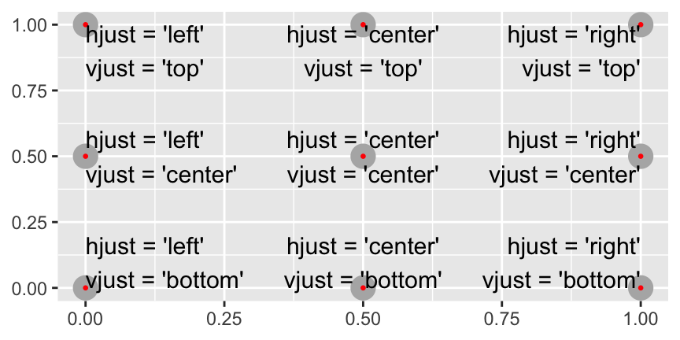

 
```{r setup, include=FALSE}
knitr::opts_chunk$set(echo = TRUE)
library(tidyverse)
library(ggrepel)
best_in_class <- mpg %>%
  group_by(class) %>%
  filter(row_number(desc(hwy)) == 1)
```
Graphics for communication
## 22.1 들어가기

새로운 사람이 여러분의 분석을 가능한 한 빠르고 쉽게 이해할 수 있도록, 탐색적 그래프를 해설적 그래프로 법을 배운다.<br>
데이터를 이해했다면 이제 이해한 바를 다른 사람들과 의사소통해야 한다.

### 22.1.1 준비하기

```r
library(tidyverse)
library(ggrepel)
```

## 22.2 라벨

- `title` 제목
- `subtitle` 부제목 (제목 아래에 작은 글꼴로 세부사항을 추가한다.)
- `caption` 플롯의 오른쪽 하단에 텍스트를 추가한다. 이 텍스트는 종종 데이터 소스를 설명하는 데 사용된다.
- `x` x축 제목
- `y` y축 제목
- `color` 범례 제목

```{r}
ggplot(mpg, aes(displ, hwy)) +
  geom_point(aes(color = class)) +
  geom_smooth(se = FALSE) +
  labs(
    title = "엔진 크기가 증가할수록 일반적으로 연비는 감소함",
    subtitle = "2인승 차(스포츠카)는 중량이 작아서 예외",
    caption = "출처 fueleconomy.gov",
    x = "배기량 (L)",
    y = "고속도로 연비 (mpg)",
    color = "차종"
  )
```

플롯 제목의 목적은 주요 발견 사항을 요약하는 것이다.<br>
'배기량 대 연비의 산점도' 같이, 플롯이 무엇인지 설명하는 제목은 피하라.<br>
짧은 변수 이름(displ)을 좀 더 자세한 설명(배기량)으로 바꾸고, 단위(L)를 포함하는 것이 좋다.

## 22.3 주석

`geom_txt()` 추가 심미성인 label을 이용하여 플롯에 텍스트 라벨을 추가할 수 있다.<br>
각 차종에서 가장 경제적인 모델을 dplyr로 뽑은 다음 라벨로 지정한다.<br>
이 방법은 라벨이 서로 겹치거나 점들과 겹치기 때문에 읽기가 어렵다.

```r
best_in_class <- mpg %>%
  group_by(class) %>%
  filter(row_number(desc(hwy)) == 1)
```

```{r}
ggplot(mpg, aes(displ, hwy)) +
  geom_point(aes(colour = class)) +
  geom_text(aes(label = model), data = best_in_class)
```

`geom_label()` 텍스트 뒤에 사각형이 그려져서 조금 나아진다.<br>
또한 `nudge_y` 파라미터를 사용하여 라벨을 해당 점의 위치보다 약간 위로 이동시킨다.<br>
맨 위 왼쪽 모서리를 살펴보면 사실은 두 개의 라벨이 겹쳐 있음을 알 수 있다.<br>

```{r}
ggplot(mpg, aes(displ, hwy)) +
  geom_point(aes(colour = class)) +
  geom_label(aes(label = model), data = best_in_class, nudge_y = 2, alpha = 0.5)
```

`ggrepel` 패키지를 사용하면 라벨이 겹치지 않도록 라벨을 자동으로 조정한다.<br>
라벨이 붙은 점을 강조하기 위해 속이 빈, 큰 점의 레이어를 추가했다.

```{r}
ggplot(mpg, aes(displ, hwy)) +
  geom_point(aes(colour = class)) +
  geom_point(size = 3, shape = 1, data = best_in_class) +
  ggrepel::geom_label_repel(aes(label = model), data = best_in_class)
```

플롯의 모서리에 라벨을 위치시키고자 하는 경우가 많은데 이 경우 `summarize()`를 사용하여 x와 y의 최댓값을 계산하는 데이터프레임을 새로 만드는 것이 편리하다.

```{r}
label <- mpg %>%
  summarise(
    displ = max(displ),
    hwy = max(hwy),
    label = "Increasing engine size is \nrelated to decreasing fuel economy."
  )

ggplot(mpg, aes(displ, hwy)) +
  geom_point() +
  geom_text(aes(label = label), data = label, vjust = "top", hjust = "right")
```

텍스트를 플롯의 테두리에 정확히 배치하려면 `+Inf`와 `-Inf`를 사용하면 된다.<br>
`tibble()`을 사용하여 데이터프레임을 만들 수 있다.

```{r}
label <- tibble(
  displ = Inf,
  hwy = Inf,
  label = "Increasing engine size is \nrelated to decreasing fuel economy."
)

ggplot(mpg, aes(displ, hwy)) +
  geom_point() +
  geom_text(aes(label = label), data = label, vjust = "top", hjust = "right")
```

- `\n` 라벨을 수동으로 줄바꿈
- `stringr::str_wrap()` 한 줄에 원하는 문자 수만큼 줄바꿈을 자동으로 추가

```{r}
"Increasing engine size is related to decreasing fuel economy." %>%
  stringr::str_wrap(width = 40) %>%
  writeLines()
```

`hjust`와 `vjust`를 사용해서 라벨 정렬을 제어한다.


## 22.4 스케일

의사소통을 위해 플롯을 더 잘 만들 수 있는 세 번째 방법은 스케일을 조정하는 것이다.<br>
스케일은 데이터값에서 인식할 수 있는 것으로의 매핑을 조정한다.<br>
일반적으로, ggplot2는 자동으로 스케일을 추가한다.

```{r}
ggplot(mpg, aes(displ, hwy)) +
  geom_point(aes(colour = class))
```

`scale_` 다음에 심미성의 이름, 그다음 `_` 그다음엔 스케일의 이름이 온다.

```r
ggplot(mpg, aes(displ, hwy)) +
  geom_point(aes(colour = class)) +
  scale_x_continuous() +
  scale_y_continuous() +
  scale_colour_discrete()
```

### 22.4.1 축 눈금, 범례 키

`breaks`는 눈금의 위치 또는 키와 관련된 값을 제어한다.<br>
기본 선택을 무시하는 데 가장 일반적으로 사용된다.

```{r}
ggplot(mpg, aes(displ, hwy)) +
  geom_point() +
  scale_y_continuous(breaks = seq(15, 40, by = 5))
```

`labels`는 각 눈금·키와 연관된 텍스트 라벨을 제어한다.<br>
`NULL`로 설정하여 라벨을 모두 표시하지 않을 수도 있다.<br>
지도 또는 절대 숫자를 공유할 수 없는 플롯을 그릴 때 유용하다.

```{r}
ggplot(mpg, aes(displ, hwy)) +
  geom_point() +
  scale_x_continuous(labels = NULL) +
  scale_y_continuous(labels = NULL)
```

데이터 포인트가 상대적으로 적은 경우 관측값이 발생한 정확한 위치를 강조하고 싶을 때도 `breaks`를 사용할 수 있다.

```{r}
presidential %>%
  mutate(id = 33 + row_number()) %>%
  ggplot(aes(start, id)) +
    geom_point() +
    geom_segment(aes(xend = end, yend = id)) +
    scale_x_date(NULL, breaks = presidential$start, date_labels = "'%y") +
    labs (
      title = "각 미국 대통령의 임기가 시작하고 끝난 때를 보여주는 플롯"
    )
```

### 22.4.2 범례 레이아웃

`theme()` 설정을 사용하면 범례의 전체 위치를 제어할 수 있다. 플롯의 데이터가 아닌 부분을 조정한다.
`legend.position theme` 설정은 범례가 배치될 위치를 조정한다.

```{r}
base <- ggplot(mpg, aes(displ, hwy)) +
  geom_point(aes(colour = class))

base + theme(legend.position = "left")
base + theme(legend.position = "top")
base + theme(legend.position = "bottom")
base + theme(legend.position = "right") # 기본값
```

다음 예제에서는 `nrow`로 범례가 사용하는 열의 개수를 조정하는 것과 점을 크게 하기 위해 심미성 하나를 재정의하는 것을 보여준다.

```{r}
ggplot(mpg, aes(displ, hwy)) +
  geom_point(aes(colour = class)) +
  geom_smooth(se = FALSE) +
  theme(legend.position = "bottom") +
  guides(colour = guide_legend(nrow = 1, override.aes = list(size = 4)))
```

### 22.4.3 스케일 교체하기

변환을 심미성 매핑에서 수행하는 대신, 스케일을 이용해서 할 수 있다.<br>
이 방법은 축이 원래 데이터 스케일로 라벨링된다는 점을 제외하고는 시각적으로 동일하다.

```{r}
ggplot(diamonds, aes(carat, price)) +
  geom_bin2d() + 
  scale_x_log10() + 
  scale_y_log10()
```

자주 사용자 정의되는 또 다른 스케일은 색상이다.<br>
기본 범주형 스케일에서는 컬러휠 주위에 등간격에 위치한 색상이 선택된다.

```{r}
ggplot(mpg, aes(displ, hwy)) +
  geom_point(aes(color = drv))

ggplot(mpg, aes(displ, hwy)) +
  geom_point(aes(color = drv)) +
  scale_colour_brewer(palette = "Set1")
```


색상의 개수가 많지 않으면 모양(shape) 매핑을 중복 추가할 수 있다.<br>
이 방법은 플롯이 흑백에서도 구분될 수 있도록 도와주기도 한다.

```{r}
ggplot(mpg, aes(displ, hwy)) +
  geom_point(aes(color = drv, shape = drv)) +
  scale_colour_brewer(palette = "Set1")
```

값과 색상 사이에 미리 정의된 매핑이 있다면 `scale_color_gradient()`를 사용하라.<br>
예를 들어 대통령 소속 정당을 색상에 매핑한다면 빨간색을 공화당, 파란색을 민주당으로 하는 표준 매핑을 사용하고자 할 것이다.

```{r}
presidential %>%
  mutate(id = 33 + row_number()) %>%
  ggplot(aes(start, id, colour = party)) +
    geom_point() +
    geom_segment(aes(xend = end, yend = id)) +
    scale_colour_manual(values = c(Republican = "red", Democratic = "blue"))
```

모든 색상 스케일은 두 가지 형태가 있음을 기억하라.<br>
`scale_color_x()`와 `scale_fill_x()`는 각각 색상과 채우기 심미성이다.

## 22.5 확대·축소

플롯 영역을 확대·축소하려면 `coord_cartesian()`을 사용하는 것이 일반적으로 제일 좋다.

```{r}
ggplot(mpg, mapping = aes(displ, hwy)) +
  geom_point(aes(color = class)) +
  geom_smooth() +
  coord_cartesian(xlim = c(5, 7), ylim = c(10, 30))

mpg %>%
  filter(displ >= 5, displ <= 7, hwy >= 10, hwy <= 30) %>%
  ggplot(aes(displ, hwy)) +
  geom_point(aes(color = class)) +
  geom_smooth()
```

개별 스케일에 대한 범위를 설정할 수도 있다.<br>
범위를 줄이는 방식은 기본적으로 데이터를 서브셋하는 것과 같다.<br>
플롯들 사이에 스케일을 일치시키는 등의 목적으로 범위를 확장하려는 경우에 일반적으로 유용하다.<br>
예를 들어 두 차종을 추출하여 각각 플롯을 그리면 세 가지 스케일(x축, y축, 색상 심미성)의 범위가 서로 다르기 때문에 플롯을 비교하기가 어렵다.<br>

```{r}
suv <- mpg %>% filter(class == "suv")
compact <- mpg %>% filter(class == "compact")

ggplot(suv, aes(displ, hwy, colour = drv)) +
  geom_point()

ggplot(compact, aes(displ, hwy, colour = drv)) +
  geom_point()
```

이 문제를 극복하는 방법 중 하나는, 여러 플롯 사이에 스케일을 공유하고, 전체 데이터의 `limits`로 스케일을 학습하는 것이다.

```{r}
x_scale <- scale_x_continuous(limits = range(mpg$displ))
y_scale <- scale_y_continuous(limits = range(mpg$hwy))
col_scale <- scale_colour_discrete(limits = unique(mpg$drv))

ggplot(suv, aes(displ, hwy, colour = drv)) +
  geom_point() +
  x_scale +
  y_scale +
  col_scale

ggplot(compact, aes(displ, hwy, colour = drv)) +
  geom_point() +
  x_scale +
  y_scale +
  col_scale
```


## 22.6 테마

마지막으로, 테마를 사용하여 플롯의 데이터가 아닌 요소를 사용자 정의할 수 있다.

```{r}
ggplot(mpg, aes(displ, hwy)) +
  geom_point(aes(color = class)) +
  geom_smooth(se = FALSE) +
  theme_bw()
```

`ggplot2`는 기본적으로 8개의 테마를 가지고 있다.


## 22.7 플롯 저장하기

플롯을 R 외부에 최종적으로 저장하는 방법은 `ggsave()`와 `knitr`이 있다.

```{r}
ggplot(mpg, aes(displ, hwy)) + geom_point()

ggsave("my-plot.pdf")
```

### 22.7.1 그림 크기 조정

- `fig.width` `fig.asp` 플롯의 너비 조정
- `out.width` 출력 크기를 조정하고 줄너비에 대한 비율로 설정한다.

### 22.7.2 기타 중요한 옵션

코드와 텍스트가 섞여있을 경우 코드 뒤에 플롯이 표시되도록 `fig.show = "hold"`설정하는 것이 좋다.<br>
코드 블록과 코드 설명을 강제로 나눌 수 있어서 유용하다.


